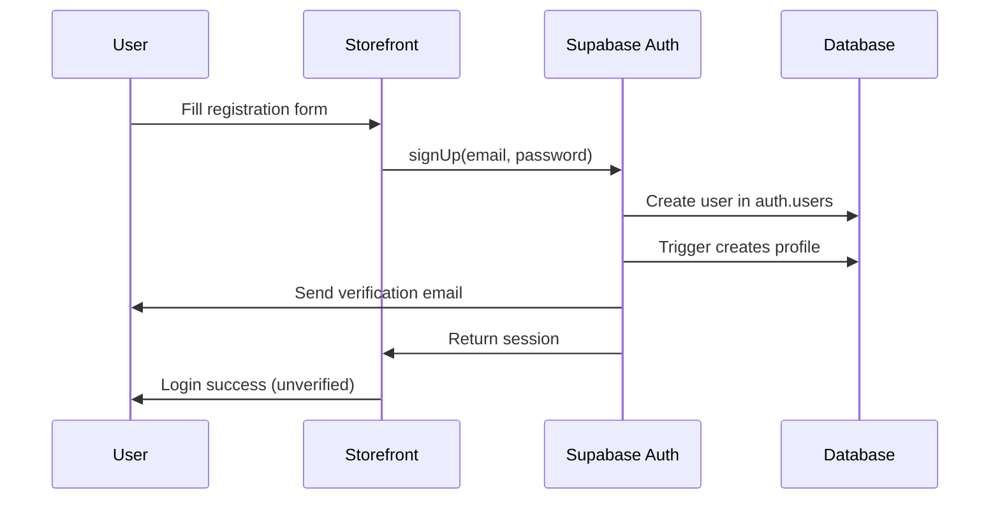
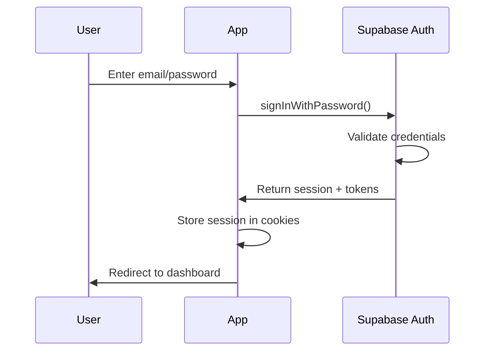

# Enhancement 01: Authentication Details

> **Supplements Section 3 of ecommerce_guide.md**  
> This document adds detailed specifications for authentication using Supabase Auth.

---

## Authentication Strategy

**Decision**: Use **Supabase Auth** for all authentication needs, with custom backend middleware for role verification.

### Why Supabase Auth?
- Built-in security best practices
- Automatic token refresh
- Multiple OAuth providers support
- Email verification built-in
- Password reset flows included
- Row Level Security integration

---

## Authentication Flow

### User Registration (Customer)



**Implementation:**
```typescript
// storefront/lib/auth.ts
import { createClient } from '@supabase/supabase-js'

export async function signUp(email: string, password: string, metadata: {
  full_name: string
}) {
  const supabase = createClient(
    process.env.NEXT_PUBLIC_SUPABASE_URL!,
    process.env.NEXT_PUBLIC_SUPABASE_ANON_KEY!
  )
  
  const { data, error } = await supabase.auth.signUp({
    email,
    password,
    options: {
      data: metadata,
      emailRedirectTo: `${window.location.origin}/auth/callback`
    }
  })
  
  return { data, error }
}
```

---

### User Login



**Implementation:**
```typescript
// storefront/lib/auth.ts
export async function signIn(email: string, password: string) {
  const supabase = createClient(
    process.env.NEXT_PUBLIC_SUPABASE_URL!,
    process.env.NEXT_PUBLIC_SUPABASE_ANON_KEY!
  )
  
  const { data, error } = await supabase.auth.signInWithPassword({
    email,
    password
  })
  
  return { data, error }
}
```

---

## Token Management

### Token Storage
- **Access Token**: Stored in HttpOnly cookies (automatically handled by Supabase)
- **Refresh Token**: Stored in HttpOnly cookies
- **Client Side**: Use `getSession()` to retrieve current session

### Token Lifecycle
- **Access Token Expiry**: 1 hour (default)
- **Refresh Token Expiry**: 30 days (configurable)
- **Auto Refresh**: Supabase client auto-refreshes 60 seconds before expiry

**Server-Side Session Check:**
```typescript
// app/api/middleware/auth.ts
import { createServerClient } from '@supabase/ssr'
import { cookies } from 'next/headers'

export async function getServerSession() {
  const cookieStore = cookies()
  
  const supabase = createServerClient(
    process.env.NEXT_PUBLIC_SUPABASE_URL!,
    process.env.NEXT_PUBLIC_SUPABASE_ANON_KEY!,
    {
      cookies: {
        get(name: string) {
          return cookieStore.get(name)?.value
        },
      },
    }
  )
  
  const { data: { session } } = await supabase.auth.getSession()
  return session
}
```

---

## Role-Based Access Control (RBAC)

### Roles Hierarchy
```
super_admin (level 3)
  └── Can manage admins, access all features
  
admin (level 2)
  └── Can manage products, orders, view analytics
  
customer (level 1)
  └── Can shop, manage own cart and orders
```

### Role Storage
Roles are stored in the `profiles` table, not in auth metadata for better RLS support:

```sql
-- In profiles table
{
  "user_id": "uuid",
  "role": "customer" | "admin" | "super_admin"
}
```

### Backend Role Verification

**Middleware for Backend API:**
```typescript
// backend/src/middlewares/auth.ts
import { FastifyRequest, FastifyReply } from 'fastify'
import { createClient } from '@supabase/supabase-js'

export async function requireAuth(
  request: FastifyRequest,
  reply: FastifyReply
) {
  const authHeader = request.headers.authorization
  
  if (!authHeader?.startsWith('Bearer ')) {
    return reply.code(401).send({ error: 'Unauthorized' })
  }
  
  const token = authHeader.substring(7)
  
  const supabase = createClient(
    process.env.SUPABASE_URL!,
    process.env.SUPABASE_SERVICE_ROLE_KEY! // Service role for verification
  )
  
  const { data: { user }, error } = await supabase.auth.getUser(token)
  
  if (error || !user) {
    return reply.code(401).send({ error: 'Invalid token' })
  }
  
  // Fetch role from profiles table
  const { data: profile } = await supabase
    .from('profiles')
    .select('role')
    .eq('user_id', user.id)
    .single()
  
  request.user = {
    id: user.id,
    email: user.email!,
    role: profile?.role || 'customer'
  }
}

export function requireAdmin(
  request: FastifyRequest,
  reply: FastifyReply
) {
  if (!request.user || !['admin', 'super_admin'].includes(request.user.role)) {
    return reply.code(403).send({ error: 'Forbidden: Admin access required' })
  }
}
```

---

## Admin Registration

### Strategy: Invitation Only

Admins cannot self-register. Only super_admins can create admin accounts.

**Flow:**
1. Super admin creates invitation in admin dashboard
2. System generates unique invitation token (24hr expiry)
3. Invitation email sent to target user
4. User clicks link, sets password
5. Account created with `admin` role

**Implementation:**
```typescript
// admin/app/api/invite-admin/route.ts
export async function POST(request: Request) {
  const session = await getServerSession()
  
  // Verify super_admin role
  if (session?.user?.role !== 'super_admin') {
    return new Response('Forbidden', { status: 403 })
  }
  
  const { email } = await request.json()
  
  // Store invitation in database
  const inviteToken = crypto.randomUUID()
  await supabase.from('admin_invitations').insert({
    email,
    token: inviteToken,
    expires_at: new Date(Date.now() + 24 * 60 * 60 * 1000),
    created_by: session.user.id
  })
  
  // Send invitation email
  await sendInvitationEmail(email, inviteToken)
  
  return Response.json({ success: true })
}
```

---

## Password Reset Flow

Uses Supabase built-in password reset:

```typescript
// storefront/app/forgot-password/page.tsx
export async function requestPasswordReset(email: string) {
  const supabase = createClient(
    process.env.NEXT_PUBLIC_SUPABASE_URL!,
    process.env.NEXT_PUBLIC_SUPABASE_ANON_KEY!
  )
  
  const { error } = await supabase.auth.resetPasswordForEmail(email, {
    redirectTo: `${window.location.origin}/reset-password`
  })
  
  return { error }
}
```

---

## OAuth Providers (Optional)

Enable social login for customers:

**Recommended Providers:**
- Google (most common)
- GitHub (developer-friendly)

**Configuration in Supabase Dashboard:**
1. Enable provider in Authentication > Providers
2. Add OAuth credentials (Client ID, Secret)
3. Set redirect URL

**Implementation:**
```typescript
export async function signInWithGoogle() {
  const supabase = createClient(
    process.env.NEXT_PUBLIC_SUPABASE_URL!,
    process.env.NEXT_PUBLIC_SUPABASE_ANON_KEY!
  )
  
  const { data, error } = await supabase.auth.signInWithOAuth({
    provider: 'google',
    options: {
      redirectTo: `${window.location.origin}/auth/callback`
    }
  })
  
  return { data, error }
}
```

---

## Session Management

### Logout
```typescript
export async function signOut() {
  const supabase = createClient(
    process.env.NEXT_PUBLIC_SUPABASE_URL!,
    process.env.NEXT_PUBLIC_SUPABASE_ANON_KEY!
  )
  
  await supabase.auth.signOut()
  // Cookies automatically cleared
}
```

### Session Persistence
- Supabase automatically persists session in localStorage (client)
- For SSR: Session stored in cookies via `@supabase/ssr`

---

## Security Checklist

- ✅ Email verification required for customers
- ✅ Admin accounts invitation-only
- ✅ Tokens stored in HttpOnly cookies
- ✅ Auto token refresh (60s before expiry)
- ✅ Role verification on backend
- ✅ Service role key kept secret (server only)
- ✅ Rate limiting on auth endpoints (see backend config)
- ✅ Password strength requirements (min 8 chars)

---

## Environment Variables Required

```bash
# Frontend (Next.js Storefront + Admin)
NEXT_PUBLIC_SUPABASE_URL=https://xxxxx.supabase.co
NEXT_PUBLIC_SUPABASE_ANON_KEY=eyJhbGc...

# Backend (Node.js API)
SUPABASE_URL=https://xxxxx.supabase.co
SUPABASE_SERVICE_ROLE_KEY=eyJhbGc...  # KEEP SECRET!
```

---

## Next Steps
- [Chunk 2] Review database schema for profiles table
- [Chunk 3] Define auth-related API endpoints
- [Chunk 7] Add payment authentication strategy
