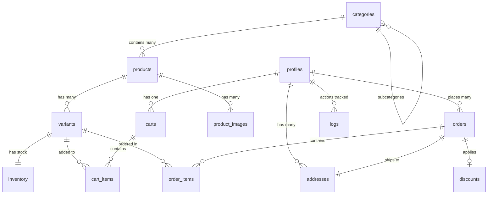

# Enhancement 02: Database Schema

> **Supplements Section 6 of ecommerce_guide.md**  
> This document provides complete SQL schema definitions for Supabase PostgreSQL.

---

## Schema Overview



---

## Migration Files

### Migration 001: Initial Schema Setup

**File**: `supabase/migrations/001_initial_schema.sql`

```sql
-- Enable UUID extension
CREATE EXTENSION IF NOT EXISTS "uuid-ossp";

-- ============================================
-- PROFILES TABLE
-- ============================================
CREATE TABLE profiles (
  id UUID PRIMARY KEY REFERENCES auth.users(id) ON DELETE CASCADE,
  email TEXT NOT NULL UNIQUE,
  full_name TEXT,
  phone TEXT,
  role TEXT NOT NULL DEFAULT 'customer' CHECK (role IN ('customer', 'admin', 'super_admin')),
  email_verified BOOLEAN DEFAULT FALSE,
  created_at TIMESTAMPTZ NOT NULL DEFAULT NOW(),
  updated_at TIMESTAMPTZ NOT NULL DEFAULT NOW()
);

CREATE INDEX idx_profiles_role ON profiles(role);
CREATE INDEX idx_profiles_email ON profiles(email);

-- Auto-update updated_at
CREATE OR REPLACE FUNCTION update_updated_at_column()
RETURNS TRIGGER AS $$
BEGIN
  NEW.updated_at = NOW();
  RETURN NEW;
END;
$$ LANGUAGE plpgsql;

CREATE TRIGGER update_profiles_updated_at
  BEFORE UPDATE ON profiles
  FOR EACH ROW
  EXECUTE FUNCTION update_updated_at_column();

-- ============================================
-- CATEGORIES TABLE
-- ============================================
CREATE TABLE categories (
  id UUID PRIMARY KEY DEFAULT uuid_generate_v4(),
  name TEXT NOT NULL,
  slug TEXT NOT NULL UNIQUE,
  description TEXT,
  parent_id UUID REFERENCES categories(id) ON DELETE SET NULL,
  image_url TEXT,
  is_active BOOLEAN DEFAULT TRUE,
  display_order INTEGER DEFAULT 0,
  created_at TIMESTAMPTZ NOT NULL DEFAULT NOW(),
  updated_at TIMESTAMPTZ NOT NULL DEFAULT NOW()
);

CREATE INDEX idx_categories_parent ON categories(parent_id);
CREATE INDEX idx_categories_slug ON categories(slug);
CREATE INDEX idx_categories_active ON categories(is_active);

CREATE TRIGGER update_categories_updated_at
  BEFORE UPDATE ON categories
  FOR EACH ROW
  EXECUTE FUNCTION update_updated_at_column();

-- ============================================
-- PRODUCTS TABLE
-- ============================================
CREATE TABLE products (
  id UUID PRIMARY KEY DEFAULT uuid_generate_v4(),
  name TEXT NOT NULL,
  slug TEXT NOT NULL UNIQUE,
  description TEXT,
  category_id UUID REFERENCES categories(id) ON DELETE SET NULL,
  base_price DECIMAL(10, 2) NOT NULL CHECK (base_price >= 0),
  is_active BOOLEAN DEFAULT TRUE,
  is_featured BOOLEAN DEFAULT FALSE,
  meta_title TEXT,
  meta_description TEXT,
  created_at TIMESTAMPTZ NOT NULL DEFAULT NOW(),
  updated_at TIMESTAMPTZ NOT NULL DEFAULT NOW()
);

CREATE INDEX idx_products_category ON products(category_id);
CREATE INDEX idx_products_slug ON products(slug);
CREATE INDEX idx_products_active ON products(is_active);
CREATE INDEX idx_products_featured ON products(is_featured);

CREATE TRIGGER update_products_updated_at
  BEFORE UPDATE ON products
  FOR EACH ROW
  EXECUTE FUNCTION update_updated_at_column();

-- ============================================
-- PRODUCT IMAGES TABLE
-- ============================================
CREATE TABLE product_images (
  id UUID PRIMARY KEY DEFAULT uuid_generate_v4(),
  product_id UUID NOT NULL REFERENCES products(id) ON DELETE CASCADE,
  image_url TEXT NOT NULL,
  alt_text TEXT,
  display_order INTEGER DEFAULT 0,
  created_at TIMESTAMPTZ NOT NULL DEFAULT NOW()
);

CREATE INDEX idx_product_images_product ON product_images(product_id);

-- ============================================
-- VARIANTS TABLE
-- ============================================
CREATE TABLE variants (
  id UUID PRIMARY KEY DEFAULT uuid_generate_v4(),
  product_id UUID NOT NULL REFERENCES products(id) ON DELETE CASCADE,
  sku TEXT NOT NULL UNIQUE,
  name TEXT NOT NULL, -- e.g., "Large / Red"
  attributes JSONB NOT NULL, -- e.g., {"size": "L", "color": "red"}
  price_adjustment DECIMAL(10, 2) DEFAULT 0, -- Added to base_price
  image_url TEXT,
  is_active BOOLEAN DEFAULT TRUE,
  created_at TIMESTAMPTZ NOT NULL DEFAULT NOW(),
  updated_at TIMESTAMPTZ NOT NULL DEFAULT NOW()
);

CREATE INDEX idx_variants_product ON variants(product_id);
CREATE INDEX idx_variants_sku ON variants(sku);
CREATE INDEX idx_variants_active ON variants(is_active);
CREATE INDEX idx_variants_attributes ON variants USING GIN(attributes);

CREATE TRIGGER update_variants_updated_at
  BEFORE UPDATE ON variants
  FOR EACH ROW
  EXECUTE FUNCTION update_updated_at_column();

-- ============================================
-- INVENTORY TABLE
-- ============================================
CREATE TABLE inventory (
  id UUID PRIMARY KEY DEFAULT uuid_generate_v4(),
  variant_id UUID NOT NULL UNIQUE REFERENCES variants(id) ON DELETE CASCADE,
  quantity INTEGER NOT NULL DEFAULT 0 CHECK (quantity >= 0),
  reserved INTEGER NOT NULL DEFAULT 0 CHECK (reserved >= 0),
  low_stock_threshold INTEGER DEFAULT 10,
  updated_at TIMESTAMPTZ NOT NULL DEFAULT NOW()
);

CREATE INDEX idx_inventory_variant ON inventory(variant_id);
CREATE INDEX idx_inventory_low_stock ON inventory(quantity) WHERE quantity <= low_stock_threshold;

CREATE TRIGGER update_inventory_updated_at
  BEFORE UPDATE ON inventory
  FOR EACH ROW
  EXECUTE FUNCTION update_updated_at_column();

-- ============================================
-- ADDRESSES TABLE
-- ============================================
CREATE TABLE addresses (
  id UUID PRIMARY KEY DEFAULT uuid_generate_v4(),
  user_id UUID NOT NULL REFERENCES profiles(id) ON DELETE CASCADE,
  full_name TEXT NOT NULL,
  phone TEXT NOT NULL,
  address_line1 TEXT NOT NULL,
  address_line2 TEXT,
  city TEXT NOT NULL,
  state TEXT NOT NULL,
  postal_code TEXT NOT NULL,
  country TEXT NOT NULL DEFAULT 'US',
  is_default BOOLEAN DEFAULT FALSE,
  created_at TIMESTAMPTZ NOT NULL DEFAULT NOW(),
  updated_at TIMESTAMPTZ NOT NULL DEFAULT NOW()
);

CREATE INDEX idx_addresses_user ON addresses(user_id);
CREATE INDEX idx_addresses_default ON addresses(user_id, is_default);

CREATE TRIGGER update_addresses_updated_at
  BEFORE UPDATE ON addresses
  FOR EACH ROW
  EXECUTE FUNCTION update_updated_at_column();

-- ============================================
-- CARTS TABLE
-- ============================================
CREATE TABLE carts (
  id UUID PRIMARY KEY DEFAULT uuid_generate_v4(),
  user_id UUID UNIQUE REFERENCES profiles(id) ON DELETE CASCADE,
  session_id TEXT, -- For anonymous users
  created_at TIMESTAMPTZ NOT NULL DEFAULT NOW(),
  updated_at TIMESTAMPTZ NOT NULL DEFAULT NOW()
);

CREATE INDEX idx_carts_user ON carts(user_id);
CREATE INDEX idx_carts_session ON carts(session_id);

CREATE TRIGGER update_carts_updated_at
  BEFORE UPDATE ON carts
  FOR EACH ROW
  EXECUTE FUNCTION update_updated_at_column();

-- ============================================
-- CART ITEMS TABLE
-- ============================================
CREATE TABLE cart_items (
  id UUID PRIMARY KEY DEFAULT uuid_generate_v4(),
  cart_id UUID NOT NULL REFERENCES carts(id) ON DELETE CASCADE,
  variant_id UUID NOT NULL REFERENCES variants(id) ON DELETE CASCADE,
  quantity INTEGER NOT NULL CHECK (quantity > 0),
  created_at TIMESTAMPTZ NOT NULL DEFAULT NOW(),
  updated_at TIMESTAMPTZ NOT NULL DEFAULT NOW(),
  UNIQUE(cart_id, variant_id)
);

CREATE INDEX idx_cart_items_cart ON cart_items(cart_id);
CREATE INDEX idx_cart_items_variant ON cart_items(variant_id);

CREATE TRIGGER update_cart_items_updated_at
  BEFORE UPDATE ON cart_items
  FOR EACH ROW
  EXECUTE FUNCTION update_updated_at_column();

-- ============================================
-- ORDERS TABLE
-- ============================================
CREATE TABLE orders (
  id UUID PRIMARY KEY DEFAULT uuid_generate_v4(),
  user_id UUID NOT NULL REFERENCES profiles(id) ON DELETE RESTRICT,
  order_number TEXT NOT NULL UNIQUE,
  status TEXT NOT NULL DEFAULT 'pending' CHECK (
    status IN ('pending', 'paid', 'processing', 'shipped', 'delivered', 'cancelled', 'refunded')
  ),
  subtotal DECIMAL(10, 2) NOT NULL,
  discount_amount DECIMAL(10, 2) DEFAULT 0,
  tax_amount DECIMAL(10, 2) DEFAULT 0,
  shipping_amount DECIMAL(10, 2) DEFAULT 0,
  total DECIMAL(10, 2) NOT NULL,
  shipping_address_id UUID REFERENCES addresses(id) ON DELETE RESTRICT,
  payment_status TEXT DEFAULT 'unpaid' CHECK (
    payment_status IN ('unpaid', 'paid', 'refunded', 'failed')
  ),
  payment_method TEXT,
  payment_intent_id TEXT, -- Stripe payment intent ID
  notes TEXT,
  created_at TIMESTAMPTZ NOT NULL DEFAULT NOW(),
  updated_at TIMESTAMPTZ NOT NULL DEFAULT NOW()
);

CREATE INDEX idx_orders_user ON orders(user_id);
CREATE INDEX idx_orders_number ON orders(order_number);
CREATE INDEX idx_orders_status ON orders(status);
CREATE INDEX idx_orders_created ON orders(created_at DESC);

CREATE TRIGGER update_orders_updated_at
  BEFORE UPDATE ON orders
  FOR EACH ROW
  EXECUTE FUNCTION update_updated_at_column();

-- ============================================
-- ORDER ITEMS TABLE
-- ============================================
CREATE TABLE order_items (
  id UUID PRIMARY KEY DEFAULT uuid_generate_v4(),
  order_id UUID NOT NULL REFERENCES orders(id) ON DELETE CASCADE,
  variant_id UUID NOT NULL REFERENCES variants(id) ON DELETE RESTRICT,
  product_name TEXT NOT NULL, -- Snapshot at time of order
  variant_name TEXT NOT NULL, -- Snapshot at time of order
  sku TEXT NOT NULL, -- Snapshot at time of order
  quantity INTEGER NOT NULL CHECK (quantity > 0),
  unit_price DECIMAL(10, 2) NOT NULL,
  total_price DECIMAL(10, 2) NOT NULL,
  created_at TIMESTAMPTZ NOT NULL DEFAULT NOW()
);

CREATE INDEX idx_order_items_order ON order_items(order_id);
CREATE INDEX idx_order_items_variant ON order_items(variant_id);

-- ============================================
-- DISCOUNTS TABLE
-- ============================================
CREATE TABLE discounts (
  id UUID PRIMARY KEY DEFAULT uuid_generate_v4(),
  code TEXT NOT NULL UNIQUE,
  type TEXT NOT NULL CHECK (type IN ('percentage', 'fixed')),
  value DECIMAL(10, 2) NOT NULL CHECK (value > 0),
  min_purchase_amount DECIMAL(10, 2) DEFAULT 0,
  max_uses INTEGER,
  times_used INTEGER DEFAULT 0,
  is_active BOOLEAN DEFAULT TRUE,
  starts_at TIMESTAMPTZ,
  expires_at TIMESTAMPTZ,
  created_at TIMESTAMPTZ NOT NULL DEFAULT NOW(),
  updated_at TIMESTAMPTZ NOT NULL DEFAULT NOW()
);

CREATE INDEX idx_discounts_code ON discounts(code);
CREATE INDEX idx_discounts_active ON discounts(is_active);

CREATE TRIGGER update_discounts_updated_at
  BEFORE UPDATE ON discounts
  FOR EACH ROW
  EXECUTE FUNCTION update_updated_at_column();

-- ============================================
-- LOGS TABLE (Audit Trail)
-- ============================================
CREATE TABLE logs (
  id UUID PRIMARY KEY DEFAULT uuid_generate_v4(),
  user_id UUID REFERENCES profiles(id) ON DELETE SET NULL,
  action TEXT NOT NULL,
  entity_type TEXT, -- e.g., 'product', 'order'
  entity_id UUID,
  details JSONB,
  ip_address INET,
  user_agent TEXT,
  created_at TIMESTAMPTZ NOT NULL DEFAULT NOW()
);

CREATE INDEX idx_logs_user ON logs(user_id);
CREATE INDEX idx_logs_entity ON logs(entity_type, entity_id);
CREATE INDEX idx_logs_created ON logs(created_at DESC);

-- ============================================
-- ADMIN INVITATIONS TABLE
-- ============================================
CREATE TABLE admin_invitations (
  id UUID PRIMARY KEY DEFAULT uuid_generate_v4(),
  email TEXT NOT NULL,
  token TEXT NOT NULL UNIQUE,
  created_by UUID NOT NULL REFERENCES profiles(id) ON DELETE CASCADE,
  expires_at TIMESTAMPTZ NOT NULL,
  used_at TIMESTAMPTZ,
  created_at TIMESTAMPTZ NOT NULL DEFAULT NOW()
);

CREATE INDEX idx_admin_invitations_token ON admin_invitations(token);
CREATE INDEX idx_admin_invitations_email ON admin_invitations(email);
```

---

### Migration 002: Row Level Security (RLS)

**File**: `supabase/migrations/002_rls_policies.sql`

```sql
-- Enable RLS on all tables
ALTER TABLE profiles ENABLE ROW LEVEL SECURITY;
ALTER TABLE addresses ENABLE ROW LEVEL SECURITY;
ALTER TABLE carts ENABLE ROW LEVEL SECURITY;
ALTER TABLE cart_items ENABLE ROW LEVEL SECURITY;
ALTER TABLE orders ENABLE ROW LEVEL SECURITY;
ALTER TABLE order_items ENABLE ROW LEVEL SECURITY;
ALTER TABLE logs ENABLE ROW LEVEL SECURITY;

-- Categories, products, variants, inventory are public read
ALTER TABLE categories ENABLE ROW LEVEL SECURITY;
ALTER TABLE products ENABLE ROW LEVEL SECURITY;
ALTER TABLE product_images ENABLE ROW LEVEL SECURITY;
ALTER TABLE variants ENABLE ROW LEVEL SECURITY;
ALTER TABLE inventory ENABLE ROW LEVEL SECURITY;
ALTER TABLE discounts ENABLE ROW LEVEL SECURITY;

-- ============================================
-- PROFILES POLICIES
-- ============================================
CREATE POLICY "Users can view own profile"
  ON profiles FOR SELECT
  USING (auth.uid() = id);

CREATE POLICY "Users can update own profile"
  ON profiles FOR UPDATE
  USING (auth.uid() = id);

CREATE POLICY "Admins can view all profiles"
  ON profiles FOR SELECT
  USING (
    EXISTS (
      SELECT 1 FROM profiles
      WHERE id = auth.uid() AND role IN ('admin', 'super_admin')
    )
  );

-- ============================================
-- ADDRESSES POLICIES
-- ============================================
CREATE POLICY "Users can CRUD own addresses"
  ON addresses FOR ALL
  USING (auth.uid() = user_id);

-- ============================================
-- CARTS POLICIES
-- ============================================
CREATE POLICY "Users can access own cart"
  ON carts FOR ALL
  USING (auth.uid() = user_id);

CREATE POLICY "Users can access own cart items"
  ON cart_items FOR ALL
  USING (
    EXISTS (
      SELECT 1 FROM carts
      WHERE carts.id = cart_items.cart_id
      AND carts.user_id = auth.uid()
    )
  );

-- ============================================
-- ORDERS POLICIES
-- ============================================
CREATE POLICY "Users can view own orders"
  ON orders FOR SELECT
  USING (auth.uid() = user_id);

CREATE POLICY "Users can create own orders"
  ON orders FOR INSERT
  WITH CHECK (auth.uid() = user_id);

CREATE POLICY "Admins can view all orders"
  ON orders FOR SELECT
  USING (
    EXISTS (
      SELECT 1 FROM profiles
      WHERE id = auth.uid() AND role IN ('admin', 'super_admin')
    )
  );

CREATE POLICY "Admins can update orders"
  ON orders FOR UPDATE
  USING (
    EXISTS (
      SELECT 1 FROM profiles
      WHERE id = auth.uid() AND role IN ('admin', 'super_admin')
    )
  );

CREATE POLICY "Users can view own order items"
  ON order_items FOR SELECT
  USING (
    EXISTS (
      SELECT 1 FROM orders
      WHERE orders.id = order_items.order_id
      AND orders.user_id = auth.uid()
    )
  );

-- ============================================
-- PUBLIC READ POLICIES
-- ============================================
CREATE POLICY "Anyone can view active categories"
  ON categories FOR SELECT
  USING (is_active = TRUE);

CREATE POLICY "Anyone can view active products"
  ON products FOR SELECT
  USING (is_active = TRUE);

CREATE POLICY "Anyone can view product images"
  ON product_images FOR SELECT
  USING (TRUE);

CREATE POLICY "Anyone can view active variants"
  ON variants FOR SELECT
  USING (is_active = TRUE);

CREATE POLICY "Anyone can view inventory"
  ON inventory FOR SELECT
  USING (TRUE);

-- ============================================
-- ADMIN POLICIES
-- ============================================
CREATE POLICY "Admins can manage categories"
  ON categories FOR ALL
  USING (
    EXISTS (
      SELECT 1 FROM profiles
      WHERE id = auth.uid() AND role IN ('admin', 'super_admin')
    )
  );

CREATE POLICY "Admins can manage products"
  ON products FOR ALL
  USING (
    EXISTS (
      SELECT 1 FROM profiles
      WHERE id = auth.uid() AND role IN ('admin', 'super_admin')
    )
  );

CREATE POLICY "Admins can manage product images"
  ON product_images FOR ALL
  USING (
    EXISTS (
      SELECT 1 FROM profiles
      WHERE id = auth.uid() AND role IN ('admin', 'super_admin')
    )
  );

CREATE POLICY "Admins can manage variants"
  ON variants FOR ALL
  USING (
    EXISTS (
      SELECT 1 FROM profiles
      WHERE id = auth.uid() AND role IN ('admin', 'super_admin')
    )
  );

CREATE POLICY "Admins can manage inventory"
  ON inventory FOR ALL
  USING (
    EXISTS (
      SELECT 1 FROM profiles
      WHERE id = auth.uid() AND role IN ('admin', 'super_admin')
    )
  );

CREATE POLICY "Admins can manage discounts"
  ON discounts FOR ALL
  USING (
    EXISTS (
      SELECT 1 FROM profiles
      WHERE id = auth.uid() AND role IN ('admin', 'super_admin')
    )
  );

-- ============================================
-- LOGS POLICIES
-- ============================================
CREATE POLICY "Admins can view all logs"
  ON logs FOR SELECT
  USING (
    EXISTS (
      SELECT 1 FROM profiles
      WHERE id = auth.uid() AND role IN ('admin', 'super_admin')
    )
  );
```

---

### Migration 003: Database Functions

**File**: `supabase/migrations/003_functions.sql`

```sql
-- ============================================
-- FUNCTION: Get Available Stock
-- ============================================
CREATE OR REPLACE FUNCTION get_available_stock(variant_uuid UUID)
RETURNS INTEGER AS $$
  SELECT (quantity - reserved)
  FROM inventory
  WHERE variant_id = variant_uuid;
$$ LANGUAGE SQL STABLE;

-- ============================================
-- FUNCTION: Reserve Inventory
-- ============================================
CREATE OR REPLACE FUNCTION reserve_inventory(
  variant_uuid UUID,
  reserve_qty INTEGER
)
RETURNS BOOLEAN AS $$
DECLARE
  available INTEGER;
BEGIN
  SELECT get_available_stock(variant_uuid) INTO available;
  
  IF available >= reserve_qty THEN
    UPDATE inventory
    SET reserved = reserved + reserve_qty
    WHERE variant_id = variant_uuid;
    RETURN TRUE;
  ELSE
    RETURN FALSE;
  END IF;
END;
$$ LANGUAGE plpgsql;

-- ============================================
-- FUNCTION: Release Inventory
-- ============================================
CREATE OR REPLACE FUNCTION release_inventory(
  variant_uuid UUID,
  release_qty INTEGER
)
RETURNS VOID AS $$
BEGIN
  UPDATE inventory
  SET reserved = GREATEST(0, reserved - release_qty)
  WHERE variant_id = variant_uuid;
END;
$$ LANGUAGE plpgsql;

-- ============================================
-- FUNCTION: Commit Inventory (After Payment)
-- ============================================
CREATE OR REPLACE FUNCTION commit_inventory(
  variant_uuid UUID,
  commit_qty INTEGER
)
RETURNS VOID AS $$
BEGIN
  UPDATE inventory
  SET 
    quantity = quantity - commit_qty,
    reserved = GREATEST(0, reserved - commit_qty)
  WHERE variant_id = variant_uuid;
END;
$$ LANGUAGE plpgsql;

-- ============================================
-- FUNCTION: Generate Order Number
-- ============================================
CREATE OR REPLACE FUNCTION generate_order_number()
RETURNS TEXT AS $$
DECLARE
  new_number TEXT;
  year_month TEXT;
  sequence_num INTEGER;
BEGIN
  year_month := TO_CHAR(NOW(), 'YYYYMM');
  
  SELECT COALESCE(MAX(
    CAST(
      SUBSTRING(order_number FROM 8) AS INTEGER
    )
  ), 0) + 1
  INTO sequence_num
  FROM orders
  WHERE order_number LIKE year_month || '%';
  
  new_number := year_month || LPAD(sequence_num::TEXT, 5, '0');
  RETURN new_number;
END;
$$ LANGUAGE plpgsql;

-- ============================================
-- FUNCTION: Auto-create Profile on Signup
-- ============================================
CREATE OR REPLACE FUNCTION handle_new_user()
RETURNS TRIGGER AS $$
BEGIN
  INSERT INTO profiles (id, email, full_name, email_verified)
  VALUES (
    NEW.id,
    NEW.email,
    NEW.raw_user_meta_data->>'full_name',
    NEW.email_confirmed_at IS NOT NULL
  );
  RETURN NEW;
END;
$$ LANGUAGE plpgsql SECURITY DEFINER;

CREATE TRIGGER on_auth_user_created
  AFTER INSERT ON auth.users
  FOR EACH ROW
  EXECUTE FUNCTION handle_new_user();
```

---

## Key Design Decisions

### 1. **Variant-Based Product System**
- Products have a `base_price`
- Variants have `price_adjustment` (can be +/- or 0)
- Final price = `base_price + variant.price_adjustment`

### 2. **Inventory Management**
- `quantity`: Total physical stock
- `reserved`: Stock temporarily held during checkout
- Available = `quantity - reserved`

### 3. **OrderSnapshot Pattern**
- Order items store product/variant names and prices at time of purchase
- Protects historical data if products are later modified

### 4. **SKU Generation**
Format: `PROD-{category_code}-{product_id_short}-{variant_attributes_hash}`

Example: `PROD-TSHIRT-A3F2-LRG-BLK`

### 5. **Soft Deletes** (Optional)
Currently using hard deletes. To implement soft deletes, add `deleted_at TIMESTAMPTZ` columns.

---

## Next Steps
- [Chunk 3] Define API endpoints that interact with these tables
- [Chunk 5] Detail the product-variant-inventory workflow
