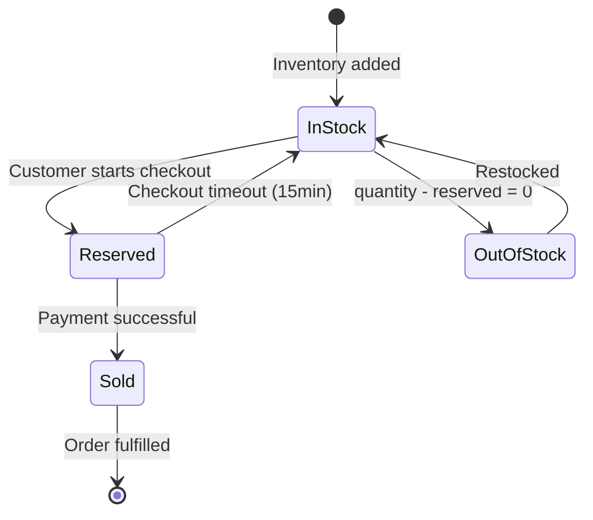
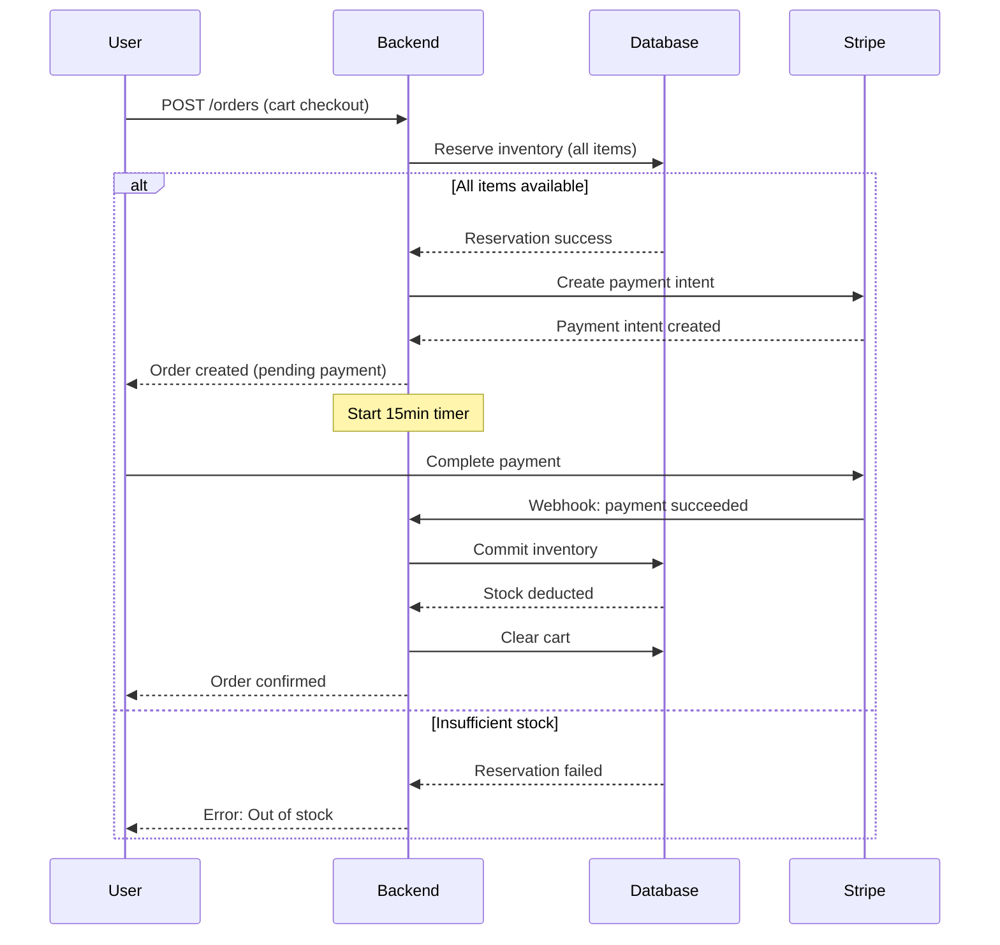

# Enhancement 05: Product & Inventory Management

> **Supplements Sections 3 & 6 of ecommerce_guide.md**  
> Detailed product-variant-inventory relationships and stock management.

---

## Product-Variant-Inventory Relationship

### Conceptual Model

```
Product (T-Shirt)
  ├── Base Price: $29.99
  ├── Variant 1: Small / Black
  │   ├── SKU: TSHIRT-CLS-S-BLK
  │   ├── Price Adjustment: $0
  │   ├── Final Price: $29.99
  │   └── Inventory: 50 units (45 available, 5 reserved)
  ├── Variant 2: Small / White
  │   ├── SKU: TSHIRT-CLS-S-WHT
  │   ├── Price Adjustment: $0
  │   ├── Final Price: $29.99
  │   └── Inventory: 30 units (30 available)
  └── Variant 3: Large / Black
      ├── SKU: TSHIRT-CLS-L-BLK
      ├── Price Adjustment: $2.00
      ├── Final Price: $31.99
      └── Inventory: 75 units (60 available, 15 reserved)
```

---

## SKU Generation Strategy

### Format
```
{CATEGORY_CODE}-{PRODUCT_CODE}-{ATTRIBUTES_HASH}
```

### Example Implementation

```typescript
// backend/src/utils/sku-generator.ts
import crypto from 'crypto'

export function generateSKU(
  categoryCode: string,
  productName: string,
  attributes: Record<string, string>
): string {
  // Product code: First 3 letters of product name
  const productCode = productName
    .toUpperCase()
    .replace(/[^A-Z]/g, '')
    .substring(0, 3)
  
  // Attributes hash: Consistent sorting for same results
  const sortedAttrs = Object.entries(attributes)
    .sort(([a], [b]) => a.localeCompare(b))
    .map(([key, value]) => `${key}:${value}`)
    .join('|')
  
  const hash = crypto
    .createHash('md5')
    .update(sortedAttrs)
    .digest('hex')
    .substring(0, 6)
    .toUpperCase()
  
  return `${categoryCode}-${productCode}-${hash}`
}

// Usage
const sku = generateSKU('TSHIRT', 'Classic T-Shirt', {
  size: 'M',
  color: 'Black'
})
// Result: TSHIRT-CLA-A3F2B1
```

### Manual SKU (Alternative)
For businesses preferring manual SKUs:
```
TSHIRT-CLS-M-BLK
└─┬─┘ └┬┘ │ └┬┘
  │    │  │  └── Color code
  │    │  └───── Size code
  │    └──────── Product code
  └───────────── Category code
```

---

## Inventory States

### Quantity Types
- **Physical Stock** (`quantity`): Total units in warehouse
- **Reserved** (`reserved`): Held during active checkouts (15min lock)
- **Available**: `quantity - reserved`

### State Transitions



---

## Inventory Management Workflows

### 1. Add to Cart

```typescript
// backend/src/services/cart.service.ts
export async function addToCart(
  userId: string,
  variantId: string,
  quantity: number
) {
  // Check available stock
  const available = await db.rpc('get_available_stock', { 
    variant_uuid: variantId 
  })
  
  if (available < quantity) {
    throw new Error(`Only ${available} units available`)
  }
  
  // Add to cart (no reservation yet)
  await db.from('cart_items').insert({
    cart_id: userCartId,
    variant_id: variantId,
    quantity
  })
  
  return { success: true }
}
```

**Note**: Stock is NOT reserved when added to cart, only checked.

---

### 2. Checkout Process (Inventory Locking)



### Implementation: Reserve Inventory

```typescript
// backend/src/services/order.service.ts
export async function createOrder(userId: string, cartId: string) {
  // Get cart items
  const cartItems = await getCartItems(cartId)
  
  // Attempt to reserve all items
  const reservations: { variantId: string; quantity: number }[] = []
  
  try {
    for (const item of cartItems) {
      const reserved = await db.rpc('reserve_inventory', {
        variant_uuid: item.variant_id,
        reserve_qty: item.quantity
      })
      
      if (!reserved) {
        // Rollback all previous reservations
        for (const res of reservations) {
          await db.rpc('release_inventory', {
            variant_uuid: res.variantId,
            release_qty: res.quantity
          })
        }
        
        throw new Error(`Variant ${item.variant_id} out of stock`)
      }
      
      reservations.push({
        variantId: item.variant_id,
        quantity: item.quantity
      })
    }
    
    // Create order
    const order = await db.from('orders').insert({
      user_id: userId,
      order_number: generateOrderNumber(),
      status: 'pending',
      // ... calculate totals
    }).select().single()
    
    // Create order items (snapshot)
    for (const item of cartItems) {
      await db.from('order_items').insert({
        order_id: order.id,
        variant_id: item.variant_id,
        product_name: item.product.name,
        variant_name: item.variant.name,
        sku: item.variant.sku,
        quantity: item.quantity,
        unit_price: calculatePrice(item),
        total_price: calculatePrice(item) * item.quantity
      })
    }
    
    // Schedule auto-release after 15 minutes
    scheduleInventoryRelease(order.id, reservations, 15 * 60 * 1000)
    
    return order
  } catch (error) {
    // Cleanup on error
    throw error
  }
}
```

---

### 3. Payment Success (Commit Inventory)

```typescript
// backend/src/webhooks/stripe.ts
export async function handlePaymentSuccess(paymentIntentId: string) {
  // Find order by payment intent
  const order = await db
    .from('orders')
    .update({ 
      status: 'paid',
      payment_status: 'paid' 
    })
    .eq('payment_intent_id', paymentIntentId)
    .select()
    .single()
  
  // Get order items
  const items = await db
    .from('order_items')
    .select('variant_id, quantity')
    .eq('order_id', order.id)
  
  // Commit inventory (deduct from quantity, release from reserved)
  for (const item of items) {
    await db.rpc('commit_inventory', {
      variant_uuid: item.variant_id,
      commit_qty: item.quantity
    })
  }
  
  // Clear user's cart
  await clearCart(order.user_id)
  
  // Send confirmation email
  await sendOrderConfirmation(order.id)
}
```

---

### 4. Payment Failed or Timeout (Release Inventory)

```typescript
// backend/src/services/order.service.ts
export async function cancelOrder(orderId: string) {
  const order = await db
    .from('orders')
    .update({ status: 'cancelled' })
    .eq('id', orderId)
    .select()
    .single()
  
  // Get order items
  const items = await db
    .from('order_items')
    .select('variant_id, quantity')
    .eq('order_id', orderId)
  
  // Release reserved inventory
  for (const item of items) {
    await db.rpc('release_inventory', {
      variant_uuid: item.variant_id,
      release_qty: item.quantity
    })
  }
}

// Auto-release scheduler (using node-cron or Redis)
function scheduleInventoryRelease(
  orderId: string,
  reservations: Array<{ variantId: string; quantity: number }>,
  delayMs: number
) {
  setTimeout(async () => {
    // Check if order is still pending
    const order = await db
      .from('orders')
      .select('status')
      .eq('id', orderId)
      .single()
    
    if (order.status === 'pending') {
      await cancelOrder(orderId)
    }
  }, delayMs)
}
```

---

## Low Stock Alerts

### Database Query

```sql
-- Get products with low stock
SELECT 
  p.name AS product_name,
  v.name AS variant_name,
  v.sku,
  i.quantity,
  i.reserved,
  (i.quantity - i.reserved) AS available,
  i.low_stock_threshold
FROM inventory i
JOIN variants v ON v.id = i.variant_id
JOIN products p ON p.id = v.product_id
WHERE (i.quantity - i.reserved) <= i.low_stock_threshold
ORDER BY available ASC;
```

### Admin Notification

```typescript
// backend/src/jobs/low-stock-check.ts
import cron from 'node-cron'

// Run daily at 9 AM
cron.schedule('0 9 * * *', async () => {
  const lowStockItems = await db.rpc('get_low_stock_items')
  
  if (lowStockItems.length > 0) {
    await sendEmailToAdmins({
      subject: `Low Stock Alert: ${lowStockItems.length} items`,
      body: generateLowStockReport(lowStockItems)
    })
  }
})
```

---

## Variant Price Calculation

### Formula
```
Final Price = Product.base_price + Variant.price_adjustment
```

### Example

```typescript
// backend/src/utils/pricing.ts
export function calculateVariantPrice(
  basePrice: number,
  priceAdjustment: number
): number {
  return Math.max(0, basePrice + priceAdjustment)
}

// Usage
const product = { base_price: 29.99 }
const variant = { price_adjustment: 2.00 }

const finalPrice = calculateVariantPrice(
  product.base_price,
  variant.price_adjustment
)
// Result: 31.99
```

### Use Cases
- **Size adjustment**: Large + $2.00, XL + $4.00
- **Material upgrade**: Premium cotton + $5.00
- **Sale price**: -$5.00 (negative adjustment)
- **No change**: $0.00

---

## Restocking Flow

### Admin Action

```typescript
// backend/src/services/inventory.service.ts
export async function restockVariant(
  variantId: string,
  addQuantity: number,
  adminUserId: string
) {
  // Update inventory
  const { data } = await db
    .from('inventory')
    .update({
      quantity: db.raw('quantity + ?', [addQuantity])
    })
    .eq('variant_id', variantId)
    .select()
    .single()
  
  // Log the action
  await db.from('logs').insert({
    user_id: adminUserId,
    action: 'inventory_restocked',
    entity_type: 'variant',
    entity_id: variantId,
    details: {
      quantity_added: addQuantity,
      new_total: data.quantity
    }
  })
  
  return data
}
```

---

## Handling Overselling

### Prevention Strategies

1. **Row-level locking** during reservation:
```sql
SELECT * FROM inventory 
WHERE variant_id = $1 
FOR UPDATE; -- Lock the row
```

2. **Atomic operations** using database functions (already implemented)

3. **Race condition handling**:
```typescript
try {
  await reserveInventory(variantId, quantity)
} catch (error) {
  if (error.code === 'INSUFFICIENT_STOCK') {
    // Refresh product page with updated stock
    return res.status(409).json({
      error: 'Stock changed during checkout',
      action: 'refresh_and_retry'
    })
  }
}
```

---

## Testing Scenarios

### Unit Tests
- ✅ SKU generation is consistent
- ✅ Available stock calculation
- ✅ Price calculation with adjustments
- ✅ Reservation with insufficient stock fails
- ✅ Commit reduces both quantity and reserved

### Integration Tests
- ✅ Complete checkout flow
- ✅ Concurrent reservations don't oversell
- ✅ Timeout releases reserved stock
- ✅ Payment failure releases stock
- ✅ Low stock alerts trigger correctly

---

## Next Steps
- [Chunk 6] Configure image storage for product/variant images
- [Chunk 7] Integrate payment flow with inventory commit
- [Chunk 8] Plan MVP implementation phases
