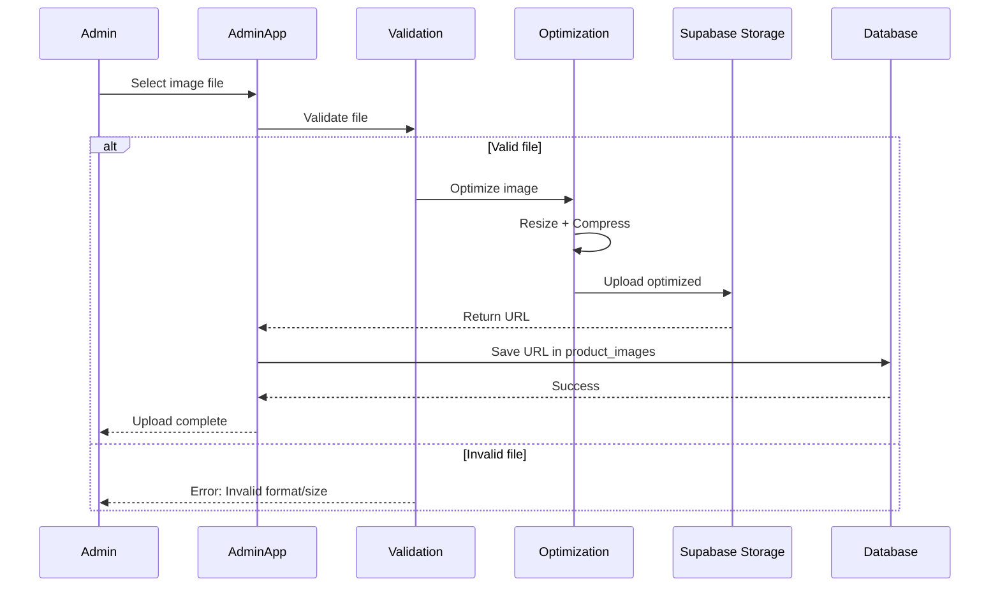

# Enhancement 06: Image Management

> **Supplements Section 3 of ecommerce_guide.md**  
> Complete image upload, optimization, and storage strategy using Supabase Storage.

---

## Supabase Storage Setup

### Bucket Configuration

**Create in Supabase Dashboard** → Storage:

1. **product-images**
   - Public bucket
   - Max file size: 5 MB
   - Allowed MIME types: image/jpeg, image/png, image/webp

2. **category-images**
   - Public bucket
   - Max file size: 2 MB
   - Allowed MIME types: image/jpeg, image/png, image/webp

3. **user-avatars** (Optional)
   - Private bucket (RLS enforced)
   - Max file size: 1 MB

### Storage Policies

```sql
-- Allow public read access to product images
CREATE POLICY "Public read access"
ON storage.objects FOR SELECT
USING (bucket_id = 'product-images');

-- Allow admins to upload product images
CREATE POLICY "Admin upload access"
ON storage.objects FOR INSERT
WITH CHECK (
  bucket_id = 'product-images' AND
  EXISTS (
    SELECT 1 FROM profiles
    WHERE id = auth.uid() AND role IN ('admin', 'super_admin')
  )
);

-- Allow admins to delete product images
CREATE POLICY "Admin delete access"
ON storage.objects FOR DELETE
USING (
  bucket_id = 'product-images' AND
  EXISTS (
    SELECT 1 FROM profiles
    WHERE id = auth.uid() AND role IN ('admin', 'super_admin')
  )
);
```

---

## File Naming Convention

### Format
```
{bucket}/{type}/{id}/{timestamp}-{original-name}
```

### Examples
```
product-images/main/a3f2b1c4.../1706123456789-tshirt-front.jpg
product-images/variants/b8e3c2d5.../1706123456790-tshirt-back.jpg
category-images/banners/c9f4d3e6.../1706123456791-summer-sale.jpg
```

---

## Image Upload Flow

### Admin Dashboard Upload



---

## Frontend Implementation (Admin)

### Upload Component

```typescript
// admin/components/ImageUpload.tsx
'use client'

import { createClient } from '@/lib/supabase/client'
import { useState } from 'react'

interface ImageUploadProps {
  productId: string
  onUploadComplete: (url: string) => void
}

export function ImageUpload({ productId, onUploadComplete }: ImageUploadProps) {
  const [uploading, setUploading] = useState(false)
  const [error, setError] = useState<string | null>(null)
  
  async function handleUpload(e: React.ChangeEvent<HTMLInputElement>) {
    const file = e.target.files?.[0]
    if (!file) return
    
    // Validate
    const validationError = validateImage(file)
    if (validationError) {
      setError(validationError)
      return
    }
    
    setUploading(true)
    setError(null)
    
    try {
      // Optimize image
      const optimizedFile = await optimizeImage(file)
      
      // Generate unique filename
      const filename = `${Date.now()}-${file.name}`
      const filepath = `main/${productId}/${filename}`
      
      // Upload to Supabase Storage
      const supabase = createClient()
      const { data, error: uploadError } = await supabase
        .storage
        .from('product-images')
        .upload(filepath, optimizedFile, {
          cacheControl: '3600',
          upsert: false
        })
      
      if (uploadError) throw uploadError
      
      // Get public URL
      const { data: { publicUrl } } = supabase
        .storage
        .from('product-images')
        .getPublicUrl(data.path)
      
      // Save to database
      await fetch('/api/products/images', {
        method: 'POST',
        headers: { 'Content-Type': 'application/json' },
        body: JSON.stringify({
          product_id: productId,
          image_url: publicUrl,
          alt_text: file.name.replace(/\.[^/.]+$/, '')
        })
      })
      
      onUploadComplete(publicUrl)
    } catch (err) {
      setError(err instanceof Error ? err.message : 'Upload failed')
    } finally {
      setUploading(false)
    }
  }
  
  return (
    <div>
      <input
        type="file"
        accept="image/jpeg,image/png,image/webp"
        onChange={handleUpload}
        disabled={uploading}
      />
      {uploading && <p>Uploading...</p>}
      {error && <p className="text-red-500">{error}</p>}
    </div>
  )
}

function validateImage(file: File): string | null {
  // Check file type
  const validTypes = ['image/jpeg', 'image/png', 'image/webp']
  if (!validTypes.includes(file.type)) {
    return 'Invalid file type. Use JPG, PNG, or WebP.'
  }
  
  // Check file size (5 MB max)
  const maxSize = 5 * 1024 * 1024
  if (file.size > maxSize) {
    return 'File too large. Maximum 5 MB.'
  }
  
  return null
}
```

---

## Image Optimization

### Client-Side Optimization

```typescript
// admin/lib/image-optimizer.ts
async function optimizeImage(file: File): Promise<File> {
  return new Promise((resolve, reject) => {
    const reader = new FileReader()
    
    reader.onload = (e) => {
      const img = new Image()
      img.src = e.target?.result as string
      
      img.onload = () => {
        const canvas = document.createElement('canvas')
        const ctx = canvas.getContext('2d')
        if (!ctx) return reject('Canvas not supported')
        
        // Resize if needed
        let { width, height } = img
        const maxDimension = 2000
        
        if (width > maxDimension || height > maxDimension) {
          if (width > height) {
            height = (height / width) * maxDimension
            width = maxDimension
          } else {
            width = (width / height) * maxDimension
            height = maxDimension
          }
        }
        
        canvas.width = width
        canvas.height = height
        
        // Draw and compress
        ctx.drawImage(img, 0, 0, width, height)
        
        canvas.toBlob(
          (blob) => {
            if (!blob) return reject('Optimization failed')
            const optimizedFile = new File([blob], file.name, {
              type: 'image/jpeg',
              lastModified: Date.now()
            })
            resolve(optimizedFile)
          },
          'image/jpeg',
          0.85 // Quality: 85%
        )
      }
      
      img.onerror = () => reject('Failed to load image')
    }
    
    reader.readAsDataURL(file)
  })
}
```

### Server-Side Optimization (Alternative)

Use Sharp library in backend:

```typescript
// backend/src/utils/image-processor.ts
import sharp from 'sharp'

export async function optimizeImage(buffer: Buffer): Promise<Buffer> {
  return sharp(buffer)
    .resize(2000, 2000, {
      fit: 'inside',
      withoutEnlargement: true
    })
    .jpeg({ quality: 85 })
    .toBuffer()
}

// Generate multiple sizes
export async function generateImageSizes(buffer: Buffer) {
  const sizes = [
    { name: 'thumbnail', width: 300 },
    { name: 'medium', width: 800 },
    { name: 'large', width: 2000 }
  ]
  
  const results = await Promise.all(
    sizes.map(async ({ name, width }) => ({
      name,
      buffer: await sharp(buffer)
        .resize(width, null, { withoutEnlargement: true })
        .jpeg({ quality: 85 })
        .toBuffer()
    }))
  )
  
  return results
}
```

---

## Responsive Images (Storefront)

### Next.js Image Component

```typescript
// storefront/components/ProductImage.tsx
import Image from 'next/image'

interface ProductImageProps {
  src: string
  alt: string
  priority?: boolean
}

export function ProductImage({ src, alt, priority }: ProductImageProps) {
  return (
    <div className="relative aspect-square">
      <Image
        src={src}
        alt={alt}
        fill
        sizes="(max-width: 768px) 100vw, (max-width: 1200px) 50vw, 33vw"
        className="object-cover"
        priority={priority}
        quality={85}
      />
    </div>
  )
}
```

### Supabase Image Transformation (Optional)

Supabase supports image transformations via URL params:

```typescript
// Get resized image
const imageUrl = supabase
  .storage
  .from('product-images')
  .getPublicUrl('path/to/image.jpg', {
    transform: {
      width: 800,
      height: 800,
      resize: 'cover',
      quality: 85
    }
  })
```

---

## Image Deletion

### Delete from Storage and DB

```typescript
// backend/src/services/product.service.ts
export async function deleteProductImage(imageId: string) {
  // Get image record
  const { data: image } = await db
    .from('product_images')
    .select('image_url')
    .eq('id', imageId)
    .single()
  
  if (!image) throw new Error('Image not found')
  
  // Extract filepath from URL
  const filepath = extractFilepathFromUrl(image.image_url)
  
  // Delete from Supabase Storage
  const { error: storageError } = await supabaseAdmin
    .storage
    .from('product-images')
    .remove([filepath])
  
  if (storageError) throw storageError
  
  // Delete from database
  await db
    .from('product_images')
    .delete()
    .eq('id', imageId)
}

function extractFilepathFromUrl(url: string): string {
  // Example URL: https://xxx.supabase.co/storage/v1/object/public/product-images/main/uuid/file.jpg
  // Extract: main/uuid/file.jpg
  const match = url.match(/product-images\/(.+)$/)
  return match ? match[1] : ''
}
```

---

## CDN Caching

### Cloudflare/Vercel CDN

Images from Supabase Storage are automatically cached when using:
- Vercel (automatic edge caching)
- Cloudflare (configure cache rules)

### Cache Headers

Set in Supabase upload:
```typescript
await supabase.storage.from('product-images').upload(filepath, file, {
  cacheControl: '31536000', // 1 year
  upsert: false
})
```

### Invalidation Strategy
- Use versioned URLs: `image.jpg?v=2`
- Or upload with new filename on changes

---

## WebP Support

### Conversion

```typescript
// Using Sharp
export async function convertToWebP(buffer: Buffer): Promise<Buffer> {
  return sharp(buffer)
    .webp({ quality: 85 })
    .toBuffer()
}
```

### Serving WebP with Fallback

```tsx
// Next.js handles this automatically
<Image src="/image.jpg" alt="Product" />
// Automatically serves WebP if browser supports it
```

---

## Image Placeholder Strategy

### Blur Placeholder

```typescript
// Generate base64 blur placeholder
import sharp from 'sharp'

async function generateBlurPlaceholder(imagePath: string): Promise<string> {
  const buffer = await sharp(imagePath)
    .resize(10) // Very small
    .blur()
    .toBuffer()
  
  return `data:image/jpeg;base64,${buffer.toString('base64')}`
}

// Store in database
await db.from('product_images').update({
  blur_placeholder: await generateBlurPlaceholder(imagePath)
}).eq('id', imageId)
```

Usage:
```tsx
<Image
  src={image.url}
  alt={image.alt_text}
  placeholder="blur"
  blurDataURL={image.blur_placeholder}
/>
```

---

## Storage Quotas

### Supabase Free Tier
- 1 GB storage
- 2 GB bandwidth/month

### Paid Plans
- Pro: 100 GB storage, 200 GB bandwidth
- Scale based on usage

### Optimization Tips
- Always compress images before upload
- Delete unused images
- Use appropriate image dimensions
- Enable CDN caching

---

## Testing Checklist

- ✅ Upload validates file type
- ✅ Upload validates file size
- ✅ Images are optimized before storage
- ✅ Public URLs are accessible
- ✅ Deletion removes from both storage and DB
- ✅ RLS policies enforce admin-only uploads
- ✅ Next.js Image component properly optimizes
- ✅ Responsive images load correctly

---

## Next Steps
- [Chunk 7] Integrate product images in payment flow
- [Chunk 8] Plan image uploads in Phase 1 implementation
