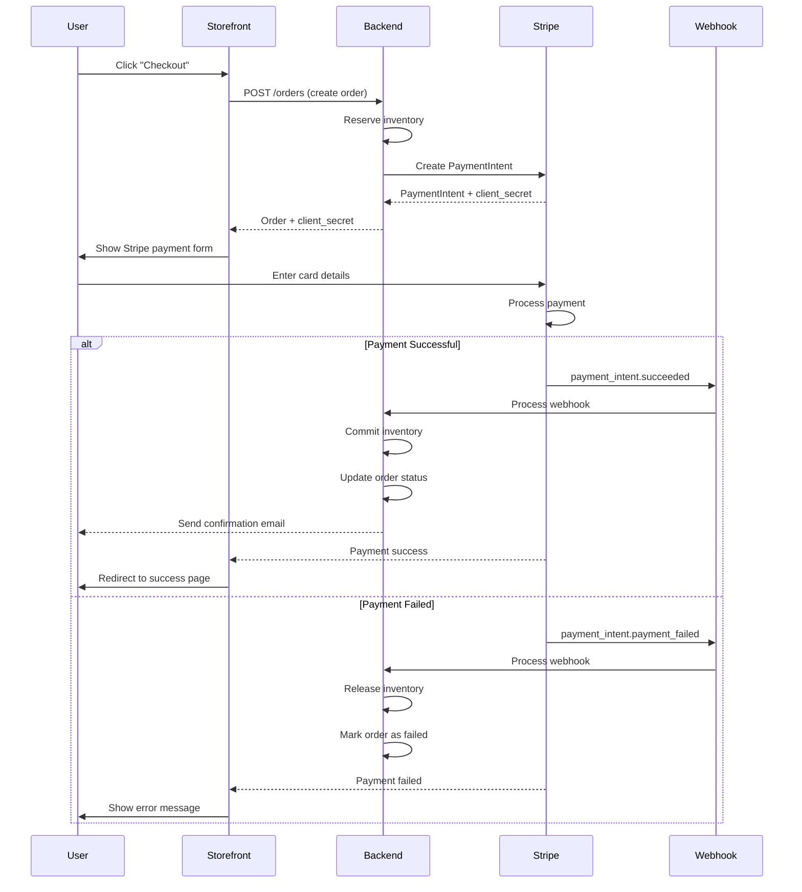

# Enhancement 07: Payment Integration

> **Supplements Section 3 of ecommerce_guide.md**  
> Complete Stripe payment integration with checkout flow and webhooks.

---

## Why Stripe?

✅ Industry standard for e-commerce  
✅ Built-in fraud protection  
✅ Easy integration with Next.js  
✅ Supports webhooks for reliable payment confirmation  
✅ Test mode for development  
✅ Strong documentation

---

## Stripe Setup

### 1. Create Stripe Account
1. Go to [stripe.com](https://stripe.com)
2. Create account
3. Get API keys from Dashboard → Developers → API keys

### 2. Install Dependencies

```bash
# Backend
cd apps/backend
npm install stripe

# Storefront
cd apps/storefront
npm install @stripe/stripe-js
```

---

## Payment Flow



---

## Backend Implementation

### Stripe Client Setup

```typescript
// backend/src/config/stripe.ts
import Stripe from 'stripe'
import { env } from './env'

export const stripe = new Stripe(env.STRIPE_SECRET_KEY, {
  apiVersion: '2024-11-20.acacia',
  typescript: true
})
```

---

### Create Payment Intent

```typescript
// backend/src/services/payment.service.ts
import { stripe } from '@/config/stripe'

export async function createPaymentIntent(
  orderId: string,
  amount: number, // in cents
  customerId?: string
) {
  const paymentIntent = await stripe.paymentIntents.create({
    amount,
    currency: 'usd',
    customer: customerId, // Optional: link to Stripe customer
    metadata: {
      order_id: orderId
    },
    automatic_payment_methods: {
      enabled: true
    }
  })
  
  return {
    client_secret: paymentIntent.client_secret,
    payment_intent_id: paymentIntent.id
  }
}
```

---

### Create Order Endpoint

```typescript
// backend/src/controllers/order.controller.ts
export async function createOrder(req: FastifyRequest, reply: FastifyReply) {
  const userId = req.user!.id
  const { shipping_address_id, discount_code } = req.body
  
  try {
    // 1. Get user's cart
    const cart = await getCart(userId)
    if (cart.items.length === 0) {
      return reply.code(400).send({ error: 'Cart is empty' })
    }
    
    // 2. Reserve inventory
    const reservations = await reserveInventoryForCart(cart)
    
    // 3. Calculate totals
    const subtotal = calculateSubtotal(cart.items)
    const { discount_amount, valid } = await validateDiscount(discount_code, subtotal)
    if (discount_code && !valid) {
      await releaseReservations(reservations)
      return reply.code(400).send({ error: 'Invalid discount code' })
    }
    
    const tax_amount = calculateTax(subtotal - discount_amount)
    const shipping_amount = calculateShipping(subtotal)
    const total = subtotal - discount_amount + tax_amount + shipping_amount
    
    // 4. Create order in database
    const order = await db.from('orders').insert({
      user_id: userId,
      order_number: generateOrderNumber(),
      status: 'pending',
      subtotal,
      discount_amount,
      tax_amount,
      shipping_amount,
      total,
      shipping_address_id,
      payment_status: 'unpaid'
    }).select().single()
    
    // 5. Create order items (snapshot)
    for (const item of cart.items) {
      await db.from('order_items').insert({
        order_id: order.id,
        variant_id: item.variant_id,
        product_name: item.product.name,
        variant_name: item.variant.name,
        sku: item.variant.sku,
        quantity: item.quantity,
        unit_price: item.price,
        total_price: item.price * item.quantity
      })
    }
    
    // 6. Create Stripe Payment Intent
    const { client_secret, payment_intent_id } = await createPaymentIntent(
      order.id,
      Math.round(total * 100) // Convert to cents
    )
    
    // 7. Update order with payment intent ID
    await db.from('orders')
      .update({ payment_intent_id })
      .eq('id', order.id)
    
    // 8. Schedule inventory release (15 min timeout)
    scheduleInventoryRelease(order.id, reservations, 15 * 60 * 1000)
    
    return reply.code(201).send({
      success: true,
      data: {
        order,
        client_secret
      }
    })
  } catch (error) {
    // Rollback reservations on error
    return reply.code(500).send({ error: 'Order creation failed' })
  }
}
```

---

## Webhook Implementation

### Setup Webhook Endpoint

```typescript
// backend/src/routes/webhooks.ts
import { FastifyInstance } from 'fastify'
import { stripe } from '@/config/stripe'
import { env } from '@/config/env'

export async function webhookRoutes(fastify: FastifyInstance) {
  fastify.post('/webhooks/stripe', {
    config: {
      rawBody: true // Important: Stripe needs raw body
    }
  }, async (req, reply) => {
    const sig = req.headers['stripe-signature'] as string
    
    let event: Stripe.Event
    
    try {
      // Verify webhook signature
      event = stripe.webhooks.constructEvent(
        req.rawBody!,
        sig,
        env.STRIPE_WEBHOOK_SECRET
      )
    } catch (err) {
      console.error('Webhook signature verification failed:', err)
      return reply.code(400).send({ error: 'Invalid signature' })
    }
    
    // Handle event
    switch (event.type) {
      case 'payment_intent.succeeded':
        await handlePaymentSuccess(event.data.object as Stripe.PaymentIntent)
        break
        
      case 'payment_intent.payment_failed':
        await handlePaymentFailed(event.data.object as Stripe.PaymentIntent)
        break
        
      default:
        console.log(`Unhandled event type: ${event.type}`)
    }
    
    return reply.code(200).send({ received: true })
  })
}

async function handlePaymentSuccess(paymentIntent: Stripe.PaymentIntent) {
  const orderId = paymentIntent.metadata.order_id
  
  // Update order status
  await db.from('orders').update({
    status: 'paid',
    payment_status: 'paid'
  }).eq('id', orderId)
  
  // Commit inventory (deduct stock)
  const items = await db
    .from('order_items')
    .select('variant_id, quantity')
    .eq('order_id', orderId)
  
  for (const item of items) {
    await db.rpc('commit_inventory', {
      variant_uuid: item.variant_id,
      commit_qty: item.quantity
    })
  }
  
  // Clear cart
  const order = await db.from('orders').select('user_id').eq('id', orderId).single()
  await db.from('cart_items').delete().eq('cart_id', order.user_id)
  
  // Send confirmation email
  await sendOrderConfirmationEmail(orderId)
  
  console.log(`✅ Payment successful for order ${orderId}`)
}

async function handlePaymentFailed(paymentIntent: Stripe.PaymentIntent) {
  const orderId = paymentIntent.metadata.order_id
  
  // Update order status
  await db.from('orders').update({
    status: 'cancelled',
    payment_status: 'failed'
  }).eq('id', orderId)
  
  // Release reserved inventory
  const items = await db
    .from('order_items')
    .select('variant_id, quantity')
    .eq('order_id', orderId)
  
  for (const item of items) {
    await db.rpc('release_inventory', {
      variant_uuid: item.variant_id,
      release_qty: item.quantity
    })
  }
  
  console.log(`❌ Payment failed for order ${orderId}`)
}
```

### Configure Webhook in Stripe

1. Go to Stripe Dashboard → Developers → Webhooks
2. Click "Add endpoint"
3. URL: `https://your-api-domain.com/api/v1/webhooks/stripe`
4. Select events:
   - `payment_intent.succeeded`
   - `payment_intent.payment_failed`
5. Copy webhook signing secret to `.env`

---

## Frontend Implementation (Storefront)

### Stripe Provider Setup

```typescript
// storefront/app/layout.tsx
import { Elements } from '@stripe/react-stripe-js'
import { loadStripe } from '@stripe/stripe-js'

const stripePromise = loadStripe(
  process.env.NEXT_PUBLIC_STRIPE_PUBLISHABLE_KEY!
)

export default function RootLayout({ children }) {
  return (
    <html>
      <body>
        <Elements stripe={stripePromise}>
          {children}
        </Elements>
      </body>
    </html>
  )
}
```

---

### Checkout Page

```typescript
// storefront/app/checkout/page.tsx
'use client'

import { useState } from 'react'
import { useStripe, useElements, PaymentElement } from '@stripe/react-stripe-js'

export default function CheckoutPage() {
  const stripe = useStripe()
  const elements = useElements()
  const [loading, setLoading] = useState(false)
  const [error, setError] = useState<string | null>(null)
  
  async function handleSubmit(e: React.FormEvent) {
    e.preventDefault()
    
    if (!stripe || !elements) return
    
    setLoading(true)
    setError(null)
    
    try {
      // 1. Create order and get client_secret
      const res = await fetch('/api/orders', {
        method: 'POST',
        headers: { 'Content-Type': 'application/json' },
        body: JSON.stringify({
          shipping_address_id: selectedAddressId,
          discount_code: discountCode
        })
      })
      
      const { data } = await res.json()
      const { order, client_secret } = data
      
      // 2. Confirm payment with Stripe
      const { error: stripeError } = await stripe.confirmPayment({
        elements,
        clientSecret: client_secret,
        confirmParams: {
          return_url: `${window.location.origin}/order-success?order_id=${order.id}`
        }
      })
      
      if (stripeError) {
        setError(stripeError.message || 'Payment failed')
      }
    } catch (err) {
      setError('An error occurred. Please try again.')
    } finally {
      setLoading(false)
    }
  }
  
  return (
    <form onSubmit={handleSubmit}>
      <PaymentElement />
      
      <button type="submit" disabled={!stripe || loading}>
        {loading ? 'Processing...' : 'Pay Now'}
      </button>
      
      {error && <p className="text-red-500">{error}</p>}
    </form>
  )
}
```

---

## Testing Payments

### Test Card Numbers

**Successful payment**:
```
Card: 4242 4242 4242 4242
Expiry: Any future date
CVC: Any 3 digits
```

**Payment fails**:
```
Card: 4000 0000 0000 0002
```

**3D Secure authentication required**:
```
Card: 4000 0025 0000 3155
```

### Stripe CLI for Webhook Testing

```bash
# Install Stripe CLI
brew install stripe/stripe-cli/stripe

# Login
stripe login

# Forward webhooks to local backend
stripe listen --forward-to localhost:3001/api/v1/webhooks/stripe

# Trigger test payment
stripe trigger payment_intent.succeeded
```

---

## Refunds (Admin)

```typescript
// backend/src/services/refund.service.ts
export async function refundOrder(orderId: string, adminUserId: string) {
  // Get order
  const order = await db.from('orders').select('*').eq('id', orderId).single()
  
  if (order.payment_status !== 'paid') {
    throw new Error('Order is not paid')
  }
  
  // Refund via Stripe
  const refund = await stripe.refunds.create({
    payment_intent: order.payment_intent_id
  })
  
  // Update order
  await db.from('orders').update({
    status: 'refunded',
    payment_status: 'refunded'
  }).eq('id', orderId)
  
  // Restock inventory
  const items = await db.from('order_items').select('*').eq('order_id', orderId)
  for (const item of items) {
    await db.from('inventory')
      .update({ quantity: db.raw('quantity + ?', [item.quantity]) })
      .eq('variant_id', item.variant_id)
  }
  
  // Log action
  await db.from('logs').insert({
    user_id: adminUserId,
    action: 'order_refunded',
    entity_type: 'order',
    entity_id: orderId,
    details: { refund_id: refund.id }
  })
  
  return refund
}
```

---

## Security Best Practices

✅ Never expose `STRIPE_SECRET_KEY` on client-side  
✅ Always verify webhook signatures  
✅ Use HTTPS in production  
✅ Store payment intent ID, not card details  
✅ Handle payment failures gracefully  
✅ Implement idempotency for webhooks  
✅ Use Stripe's test mode during development  
✅ Enable Stripe Radar for fraud detection

---

## Production Checklist

- [ ] Replace test keys with live keys
- [ ] Configure live webhook endpoint in Stripe
- [ ] Enable 3D Secure authentication
- [ ] Set up Stripe Radar rules
- [ ] Test complete payment flow
- [ ] Test refund flow
- [ ] Set up payment failure alerting
- [ ] Review Stripe fee structure
- [ ] Enable payment method types needed (cards, Apple Pay, etc.)

---

## Next Steps
- [Chunk 8] Add payment integration to Phase 2 of implementation plan
