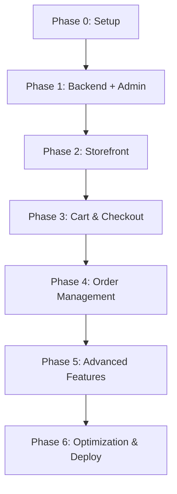

# Enhancement 08: Phased Implementation Plan

> **Supplements Section 14 of ecommerce_guide.md**
> Actionable implementation roadmap broken into manageable phases.

---

## ⚡ Timeline with Claude Code

**Original estimate:** 17 weeks (manual development)
**With Claude Code:** **2-3 weeks** (AI-assisted development)

Claude Code can write all the code systematically, which eliminates:
- Learning curve time
- Debugging delays
- Code review iterations
- Implementation uncertainties

**Realistic timeline breakdown:**
- Phase 0: 2-3 hours
- Phase 1: 2-3 days
- Phase 2: 2-3 days
- Phase 3: 3-4 days
- Phase 4: 1-2 days
- Phase 5: 2-3 days
- Phase 6: 1-2 days
- **Total: 2-3 weeks**

---

## Implementation Philosophy

**Goal**: Build incrementally, test continuously, deploy early.

- ✅ Each phase delivers working features
- ✅ Test thoroughly before moving to next phase
- ✅ Deploy each phase to staging
- ✅ Get feedback and iterate

---

## Phase 0: Setup & Infrastructure (2-3 hours)

### Goals
Set up the foundation for the entire project including real-time infrastructure.

### Tasks

#### 1. Monorepo Setup
```bash
# Initialize monorepo with pnpm workspaces
mkdir ecommerce-platform
cd ecommerce-platform
pnpm init
```

**Create workspace structure**:
```
ecommerce-platform/
├── apps/
│   ├── storefront/
│   ├── admin/
│   └── backend/
├── packages/
│   ├── ui/
│   ├── utils/
│   └── config/
├── supabase/
│   └── migrations/
├── pnpm-workspace.yaml
└── package.json
```

**pnpm-workspace.yaml**:
```yaml
packages:
  - 'apps/*'
  - 'packages/*'
```

#### 2. Create Next.js Apps

```bash
# Storefront
cd apps
npx create-next-app@latest storefront --typescript --tailwind --app

# Admin
npx create-next-app@latest admin --typescript --tailwind --app

# Backend
mkdir backend
cd backend
npm init -y
npm install fastify typescript @types/node
```

#### 3. Supabase Project Setup

1. Go to [supabase.com](https://supabase.com)
2. Create new project
3. Copy credentials to `.env.example`
4. Initialize migrations:
   ```bash
   npx supabase init
   ```

#### 4. Initial Database Schema

Run migrations:
```bash
npx supabase db push
```

Use migrations from Enhancement 02.

#### 5. Environment Configuration

Create `.env` files for all apps using Enhancement 04 templates.

#### 6. Socket.io + Redis Setup

**Install Socket.io in backend:**
```bash
cd apps/backend
npm install socket.io @socket.io/redis-adapter ioredis
```

**Setup Redis (for WebSocket scaling):**
```bash
# macOS
brew install redis
brew services start redis

# Linux
sudo apt-get install redis-server
sudo systemctl start redis

# Or use Docker
docker run -d -p 6379:6379 redis:alpine
```

**Update environment variables:**
```bash
# Add to backend/.env
REDIS_URL=redis://localhost:6379
STOREFRONT_URL=http://localhost:3000
ADMIN_URL=http://localhost:3002
```

#### 7. Git Repository

```bash
git init
git add .gitignore
git commit -m "Initial commit: Monorepo setup with WebSocket infrastructure"
```

**📦 Deliverable**: Working monorepo with all apps scaffolded + WebSocket infrastructure ready.

---

## Phase 1: MVP Backend + Admin (2-3 days)

### Goals
Build core backend API, WebSocket system, and basic admin dashboard to manage products.

### Backend Tasks

#### 1.1 Auth Implementation
- [ ] Supabase Auth integration
- [ ] JWT middleware
- [ ] Role-based access control
- [ ] Test auth endpoints

#### 1.2 Product Management API
- [ ] `POST /products` - Create product
- [ ] `GET /products` - List products
- [ ] `GET /products/:slug` - Get product
- [ ] `PUT /products/:id` - Update product
- [ ] `DELETE /products/:id` - Delete product

#### 1.3 Category Management API
- [ ] `POST /categories` - Create category
- [ ] `GET /categories` - List categories
- [ ] Category tree support

#### 1.4 Variant & Inventory API
- [ ] `POST /products/:id/variants` - Create variant
- [ ] `GET /products/:id/variants` - List variants
- [ ] `PATCH /variants/:id/inventory` - Update stock

#### 1.5 Image Upload
- [ ] Supabase Storage setup
- [ ] Image upload endpoint
- [ ] Image optimization

#### 1.6 WebSocket Setup
- [ ] Socket.io server configuration
- [ ] WebSocket authentication middleware
- [ ] Event handler architecture
- [ ] Admin notification system (new orders, low stock)
- [ ] Test WebSocket connections

### Admin Dashboard Tasks

#### 1.7 Admin Auth
- [ ] Login page
- [ ] Logout functionality
- [ ] Protected routes
- [ ] Super admin invitation system

#### 1.8 Socket.io Client Setup (Admin)
- [ ] Socket.io client installation
- [ ] WebSocket connection manager
- [ ] Authentication with token
- [ ] Connection status indicator

#### 1.9 Product Management UI
- [ ] Products list table
- [ ] Create product form
- [ ] Edit product form
- [ ] Delete confirmation modal

#### 1.10 Category Management UI
- [ ] Categories list
- [ ] Create category form
- [ ] Edit category form

#### 1.11 Variant Management UI
- [ ] Variant creation (size, color, etc.)
- [ ] SKU generation
- [ ] Inventory management form

#### 1.12 Image Management UI
- [ ] Multi-image upload
- [ ] Image preview
- [ ] Image deletion
- [ ] Reorder images

#### 1.13 Real-time Admin Notifications
- [ ] New order notification component (with sound)
- [ ] Low stock alert component
- [ ] Toast/notification system

### Testing Phase 1
- [ ] Create 5+ test products with variants
- [ ] Upload images for all products
- [ ] Test inventory updates
- [ ] Verify RLS policies
- [ ] Test WebSocket connections
- [ ] Test admin notifications

**📦 Deliverable**: Admin can fully manage products, categories, variants, and inventory + receive real-time notifications.

---

## Phase 2: Customer Storefront (2-3 days)

### Goals
Build customer-facing e-commerce website with WebSocket client.

### Storefront Tasks

#### 2.1 Home Page
- [ ] Hero banner
- [ ] Featured products grid
- [ ] Category cards
- [ ] SEO metadata

#### 2.2 Product Listing Page
- [ ] Product grid with images
- [ ] Category filtering
- [ ] Search functionality
- [ ] Sorting (price, newest, popular)
- [ ] Pagination

#### 2.3 Product Detail Page
- [ ] Product images carousel
- [ ] Variant selection (size, color)
- [ ] Price display
- [ ] Add to cart button
- [ ] Stock availability indicator
- [ ] Product description
- [ ] SEO optimized

#### 2.4 Customer Auth
- [ ] Register page
- [ ] Login page
- [ ] Password reset flow
- [ ] OAuth (Google) - optional

#### 2.5 Header & Navigation
- [ ] Logo and navigation menu
- [ ] Category dropdown
- [ ] Search bar
- [ ] Cart icon with count
- [ ] User profile dropdown

#### 2.6 Footer
- [ ] Links (About, Contact, Privacy, Terms)
- [ ] Social media icons
- [ ] Newsletter signup - optional

#### 2.7 Socket.io Client Setup (Storefront)
- [ ] Socket.io client installation
- [ ] WebSocket connection manager
- [ ] Authentication with user token
- [ ] Connection status handling

### Testing Phase 2
- [ ] Browse products
- [ ] Search products
- [ ] Filter by category
- [ ] View product details
- [ ] Test WebSocket connection
- [ ] Responsive design on mobile

**📦 Deliverable**: Customers can browse and view products.

---

## Phase 3: Cart & Checkout (3-4 days)

### Goals
Enable customers to purchase products with real-time inventory updates and cart sync.

### Backend Tasks

#### 3.1 Cart API
- [ ] `GET /cart` - Get user cart
- [ ] `POST /cart/items` - Add item
- [ ] `PATCH /cart/items/:id` - Update quantity
- [ ] `DELETE /cart/items/:id` - Remove item
- [ ] Real-time stock validation

#### 3.2 Order API
- [ ] `POST /orders` - Create order
- [ ] `GET /orders` - List user orders
- [ ] `GET /orders/:id` - Get order details
- [ ] Inventory reservation logic
- [ ] Order number generation

#### 3.3 Address API
- [ ] `POST /addresses` - Create address
- [ ] `GET /addresses` - List user addresses
- [ ] `PATCH /addresses/:id` - Update address
- [ ] `DELETE /addresses/:id` - Delete address

#### 3.4 Stripe Integration
- [ ] Create Payment Intent endpoint
- [ ] Webhook handler (`payment_intent.succeeded`)
- [ ] Webhook handler (`payment_intent.payment_failed`)
- [ ] Inventory commit on payment success
- [ ] Inventory release on payment failure

#### 3.5 WebSocket Events (Backend)
- [ ] Live inventory update broadcasting
- [ ] Cart sync event handlers
- [ ] Order creation notification (to admins)
- [ ] Integrate with order creation service

### Storefront Tasks

#### 3.6 Real-time Inventory Component
- [ ] Live stock updates on product pages
- [ ] Subscribe to product stock changes
- [ ] "Out of stock" instant updates
- [ ] Stock count changes in real-time

#### 3.7 Cart Sync Component
- [ ] Cross-device cart synchronization
- [ ] Real-time cart updates
- [ ] Sync cart on WebSocket connection

#### 3.8 Cart Page
- [ ] Cart items list
- [ ] Quantity update controls
- [ ] Remove item button
- [ ] Cart totals (subtotal, tax, shipping, total)
- [ ] "Proceed to Checkout" button

#### 3.9 Checkout Flow
- [ ] Shipping address form
- [ ] Address selection (saved addresses)
- [ ] Order summary sidebar
- [ ] Discount code input
- [ ] Stripe payment form
- [ ] Payment processing indicator

#### 3.10 Order Confirmation
- [ ] Success page after payment
- [ ] Order details display
- [ ] Confirmation email

#### 3.11 Order History
- [ ] User profile page
- [ ] Orders list
- [ ] Order detail view

### Testing Phase 3
- [ ] Add multiple items to cart
- [ ] Update quantities
- [ ] Remove items
- [ ] Test real-time stock updates
- [ ] Test cart sync across devices
- [ ] Complete checkout with test card
- [ ] Verify inventory is deducted
- [ ] Test payment failure scenario
- [ ] Verify cart is cleared after purchase
- [ ] Test admin receives order notification

**📦 Deliverable**: Full e-commerce checkout experience with real-time inventory updates and cart sync.

---

## Phase 4: Admin Order Management (1-2 days)

### Goals
Enable admins to manage orders with real-time updates and live dashboard.

### Admin Tasks

#### 4.1 Orders Dashboard
- [ ] Orders list with filters (status, date range)
- [ ] Search by order number
- [ ] Pagination
- [ ] Order status badges

#### 4.2 Order Detail Page
- [ ] Customer information
- [ ] Order items
- [ ] Shipping address
- [ ] Payment status
- [ ] Order timeline

#### 4.3 Order Status Management
- [ ] Update order status (processing, shipped, delivered)
- [ ] Add tracking number
- [ ] Status change notifications (email)

#### 4.4 Live Analytics Dashboard
- [ ] Total revenue (updates in real-time)
- [ ] Total orders (updates in real-time)
- [ ] Average order value
- [ ] Top selling products
- [ ] Revenue by day/week/month chart
- [ ] Live metrics component with WebSocket

#### 4.5 Real-time Order Updates
- [ ] Live order list (auto-updates when new orders arrive)
- [ ] Order status change broadcasting
- [ ] Sound notification for new orders
- [ ] Toast notifications for all order events

### Testing Phase 4
- [ ] View all orders
- [ ] Filter orders by status
- [ ] Update order status
- [ ] View analytics
- [ ] Test new order notifications
- [ ] Test live dashboard updates
- [ ] Test order status change notifications

**📦 Deliverable**: Admins can manage and track orders with real-time notifications and live dashboard.

---

## Phase 5: Advanced Features (2-3 days)

### Goals
Add polish, advanced features, and optimize WebSocket performance.

### Backend Tasks

#### 5.1 Discount System
- [ ] Discount code creation API
- [ ] Validate discount code
- [ ] Apply discount to order
- [ ] Track usage count

#### 5.2 User Management (Admin)
- [ ] List all users
- [ ] View user details
- [ ] Change user role
- [ ] View user order history

#### 5.3 Audit Logs
- [ ] Log all admin actions
- [ ] Log viewer in admin dashboard

#### 5.4 Email Notifications
- [ ] Order confirmation
- [ ] Shipping notification
- [ ] Low stock alerts (admin)

### Storefront Tasks

#### 5.5 Product Reviews (Optional)
- [ ] Review submission
- [ ] Star ratings
- [ ] Display reviews on product page

#### 5.6 Wishlist (Optional)
- [ ] Add to wishlist
- [ ] View wishlist
- [ ] Remove from wishlist

#### 5.7 Search Improvements
- [ ] Full-text search (Postgres or Algolia)
- [ ] Search suggestions
- [ ] Search results highlighting

### Admin Tasks

#### 5.8 Discount Management
- [ ] Create discount codes
- [ ] Edit discount codes
- [ ] View usage statistics
- [ ] Deactivate codes

#### 5.9 User Management UI
- [ ] Users list
- [ ] User detail page
- [ ] Role assignment

### Testing Phase 5
- [ ] Create and apply discount codes
- [ ] Test all email notifications
- [ ] Review audit logs

**📦 Deliverable**: Polished e-commerce platform with advanced features.

---

## Phase 6: Optimization & Deployment (1-2 days)

### Goals
Optimize performance (including WebSocket), test thoroughly, and deploy to production.

### Performance Optimization

#### 6.1 Frontend
- [ ] Image optimization (WebP, lazy loading)
- [ ] Code splitting
- [ ] Bundle size analysis
- [ ] Lighthouse score > 90

#### 6.2 Backend
- [ ] Database query optimization
- [ ] Add database indexes
- [ ] API response caching (Redis)
- [ ] Rate limiting

#### 6.2.1 WebSocket Optimization
- [ ] WebSocket connection pooling
- [ ] Event rate limiting
- [ ] Redis adapter for horizontal scaling
- [ ] WebSocket connection monitoring
- [ ] Optimize broadcast patterns (use rooms efficiently)

#### 6.3 SEO
- [ ] Dynamic meta tags
- [ ] Structured data (JSON-LD)
- [ ] Sitemap generation
- [ ] robots.txt

### Testing

#### 6.4 E2E Tests
- [ ] Playwright/Cypress tests for critical flows
- [ ] Cart checkout flow
- [ ] Payment flow

#### 6.5 Load Testing
- [ ] Load test backend API
- [ ] Stress test checkout flow

### Deployment

#### 6.6 Production Setup
- [ ] Deploy backend to Railway/Render (with WebSocket support)
- [ ] Deploy storefront to Vercel
- [ ] Deploy admin to Vercel
- [ ] Configure production environment variables (including Redis)
- [ ] Set up custom domain
- [ ] SSL certificates (WSS for WebSocket)
- [ ] Configure sticky sessions for load balancing (WebSocket)
- [ ] Test WebSocket connections in production

#### 6.7 Monitoring
- [ ] Set up Sentry for error tracking
- [ ] Set up uptime monitoring (UptimeRobot)
- [ ] Database backups (Supabase)
- [ ] Log aggregation
- [ ] WebSocket connection monitoring
- [ ] Track active WebSocket connections
- [ ] Monitor WebSocket event throughput

#### 6.8 CI/CD
- [ ] GitHub Actions workflow
- [ ] Lint and type check on PR
- [ ] Auto-deploy on merge to main

**📦 Deliverable**: Production-ready e-commerce platform.

---

## Timeline Summary

### With Claude Code (AI-Assisted Development)

| Phase | Duration | Deliverable |
|-------|----------|-------------|
| **Phase 0** | 2-3 hours | Project setup + WebSocket infrastructure |
| **Phase 1** | 2-3 days | Admin product management + real-time notifications |
| **Phase 2** | 2-3 days | Customer storefront + WebSocket client |
| **Phase 3** | 3-4 days | Cart & checkout + live inventory + cart sync |
| **Phase 4** | 1-2 days | Admin order management + live dashboard |
| **Phase 5** | 2-3 days | Advanced features + WebSocket optimization |
| **Phase 6** | 1-2 days | Optimization & production deployment |
| **TOTAL** | **2-3 weeks** | Full production-ready e-commerce platform |

### Manual Development (Original Estimate)

| Phase | Duration | Notes |
|-------|----------|-------|
| **Total** | ~17 weeks | Without AI assistance, including learning curve, debugging, and iterations |

---

## Dependency Graph



---

## Risk Mitigation

### Common Pitfalls
1. **Scope Creep**: Stick to MVP features first
2. **Overengineering**: Use simple solutions initially
3. **Testing Delays**: Test after each phase, not at the end
4. **Performance Issues**: Optimize early (images, queries)

### Success Factors
- ✅ Deploy early and often (staging environment)
- ✅ Get user feedback in Phase 3
- ✅ Keep backend and frontend in sync
- ✅ Document as you build
- ✅ Use feature flags for experimental features

---

## Recommended Team Structure

### With Claude Code (AI-Assisted)

**Solo Developer + Claude Code**
- Follow phases sequentially
- Claude Code writes all implementation code
- Developer focuses on planning, testing, and deployment
- **2-3 weeks to completion**

**Team + Claude Code**
- Use Claude Code to write implementation code
- Team focuses on architecture decisions, testing, and review
- **1-2 weeks to completion** with proper coordination

### Manual Development (Without AI)

**Solo Developer**
- Follow phases sequentially
- ~4-6 months to completion

**2-Person Team**
- **Dev 1**: Backend + Admin
- **Dev 2**: Storefront
- Sync at phase boundaries
- ~3-4 months to completion

**3+ Person Team**
- **Backend Dev**: API development
- **Frontend Dev 1**: Storefront
- **Frontend Dev 2**: Admin dashboard
- **DevOps**: CI/CD, deployment
- ~2-3 months to completion

---

## Next Actions

**Start immediately**:
1. Create GitHub repository
2. Run Phase 0 setup
3. Create Supabase project
4. Begin Phase 1 backend development

**Good luck! 🚀**
